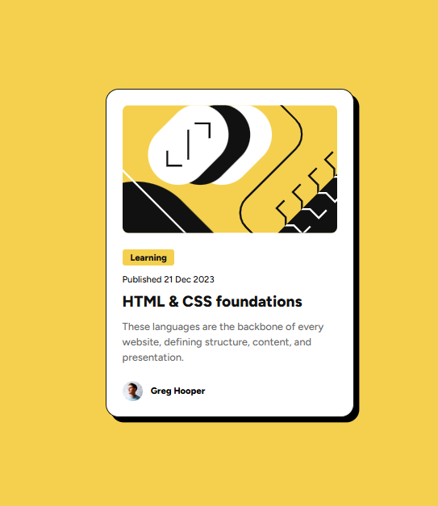

# Frontend Mentor - Blog Preview Card

This is a solution to the [Blog Preview Card challenge on Frontend Mentor](https://www.frontendmentor.io/challenges/blog-preview-card-ckPaj01IcS).  
Frontend Mentor challenges help you improve your coding skills by building realistic projects.

## Overview

### Screenshot

### Links

- Live Site URL: [https://ayomide0908.github.io/blog-preview-card/](https://ayomide0908.github.io/blog-preview-card/)

## My Process

### Built With
- Semantic HTML5 markup  
- CSS custom properties  
- Flexbox  

### What I Learned
I improved my ability to structure and style a simple card component using **HTML and CSS**.  
Key takeaways:
- How to use **Flexbox** for alignment.  
- Applying **hover states** for interactivity.  
- Organizing reusable CSS with custom properties.  

### Continued Development
I want to focus more on:
- Responsiveness across different devices.  
- Adding transitions/animations for a smoother UI.  

## Author
- Frontend Mentor – [@ayomide0908](https://www.frontendmentor.io/profile/ayomide0908)  
- GitHub – [@ayomide0908](https://github.com/ayomide0908)
